

---

## 👨‍💻 About Me

I'm a software engineer and DevOps engineer based in **Kraków, Poland** who loves turning complex infrastructure ideas into clean, production-grade systems. After 5 years shipping enterprise SaaS features at HCL Software, I moved into a DevOps role at Pegasystems and continue to build **TheyCloud** — a production-grade white-label cloud platform I designed and built from scratch.

**TheyCloud at a glance:** 250K+ LOC · 124+ REST APIs · 354 domain events across 24 business contexts · 50+ DB tables · 44+ test suites (80%+ coverage)

- 🏗️ **Side project** → [TheyCloud](https://github.com/hyzco) — white-label cloud platform (node-licensed)
- 💼 **Currently** → DevOps Engineer at **Pegasystems**, Kraków
- 🌱 **Always learning** → distributed systems, event-driven design, Go performance
- 🇵🇱 Relocated from Istanbul → Warsaw → Kraków

---

## 🚀 What I'm Building — TheyCloud

A fully custom cloud management platform covering the entire stack:

| Repo | Stack | Description |
|---|---|---|
| **TheyCloud-API** | Node.js · TypeScript · Knex · MySQL | Event-driven backend — billing, VPS, DNS, networking, support |
| **Technox-Cloud-UI** | Next.js · TypeScript · MUI · Redux | Cloud control panel UI — dashboards, VM management, billing |
| **TheyCloud-HostAgent** | Go · WebSocket | Lightweight node agent — real-time metrics, service control, log streaming |
| **TheyCloud-DevOps** | Docker · CI/CD | Infrastructure automation & self-hosted services |

> Architecture: **Domain-Driven Design + Event Sourcing** — payments, subscriptions, provisioning, and networking are fully decoupled via an in-house event bus with immutable event sourcing and 7-year audit retention for SOC 2/GDPR compliance.

### 🔧 Platform Capabilities

| Domain | What it covers |
|---|---|
| **Compute** | VM & LXC container lifecycle — provision, start/stop/restart, clone, snapshot, resize |
| **Networking** | VPC creation, subnet management, IP allocation, VxLAN overlay, firewall rules |
| **Storage** | Block volumes, object storage (S3-compatible), backup policies, retention rules |
| **Cloud Hosting** | App & site deployments, SSL certificate management, CDN integration |
| **DNS** | Full zone management — A, AAAA, CNAME, MX, TXT, SRV records via PowerDNS |
| **Billing** | Balance-based model, usage tracking per resource, invoicing, payment intents, grace periods |
| **Support** | Ticket system with priority levels, knowledge base, operator assignment |
| **Monitoring** | Real-time uptime tracking, CPU/Memory/Network/Disk gauges, health scoring, alert rules |
| **Auth & Teams** | JWT + refresh tokens, 2FA, role-based access, team member management |
| **White-Label** | Full rebranding support — per-node licensing model for resellers and hosters |

### 📸 Marketing Pages

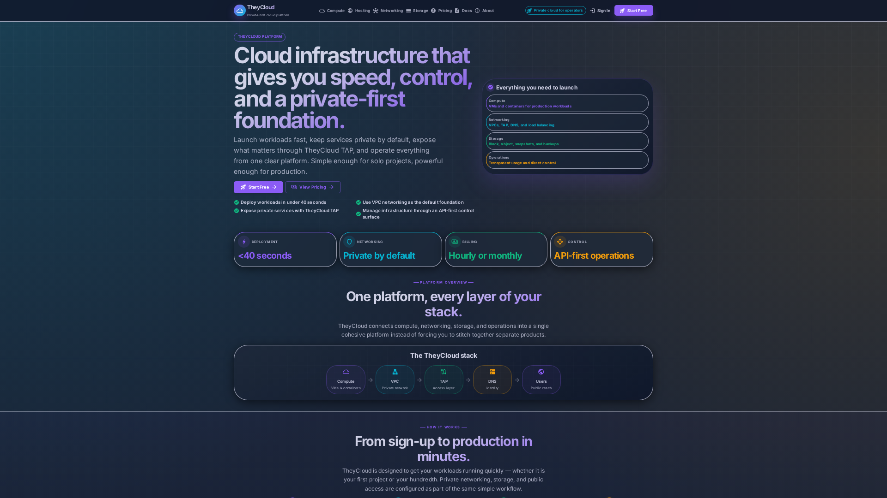
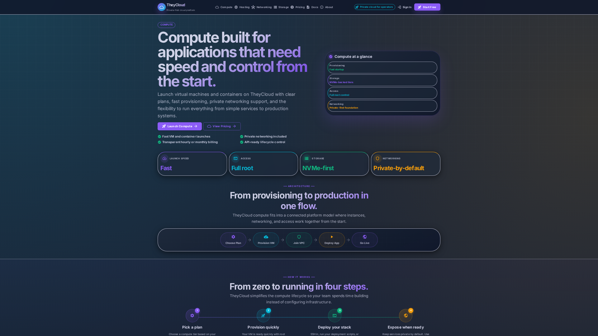
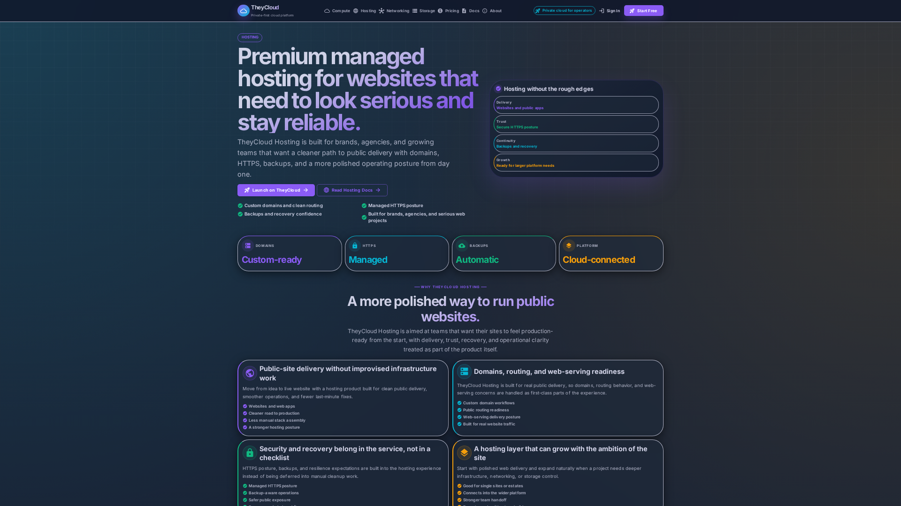

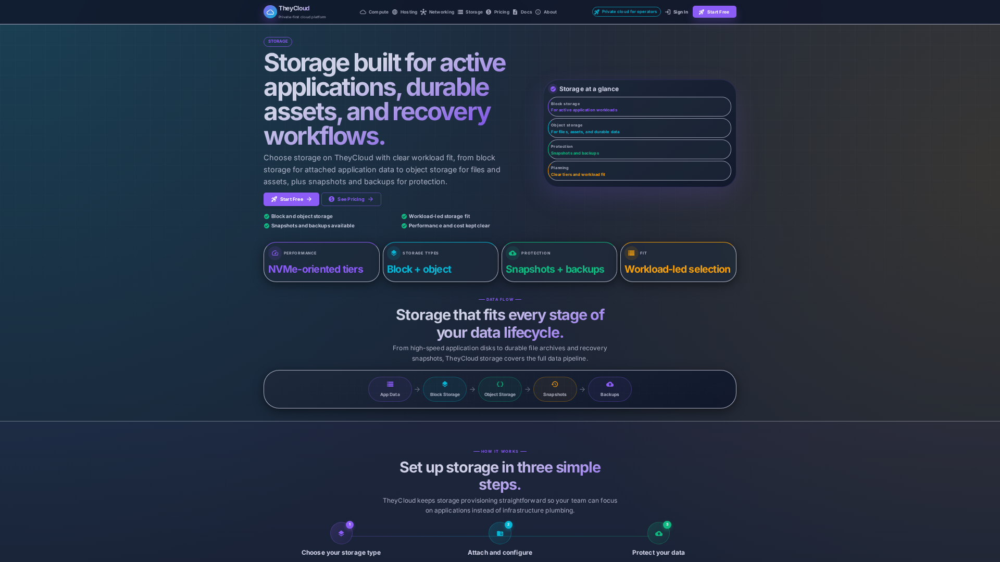
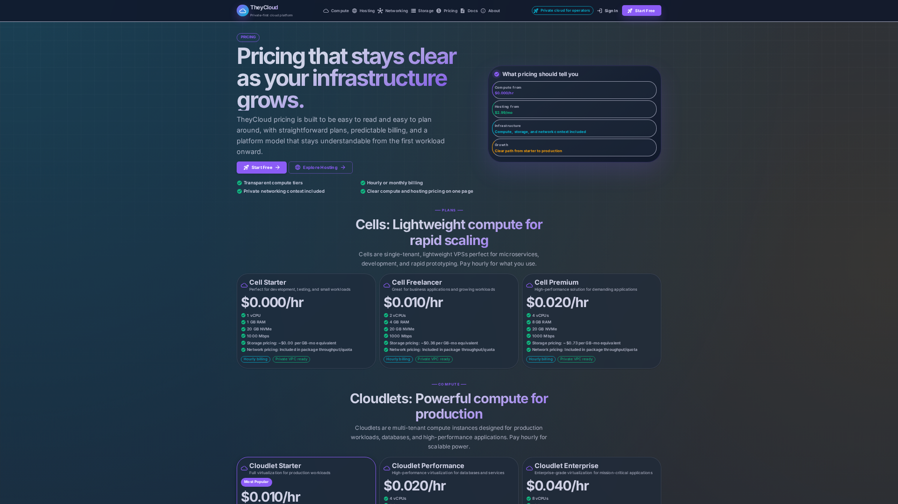
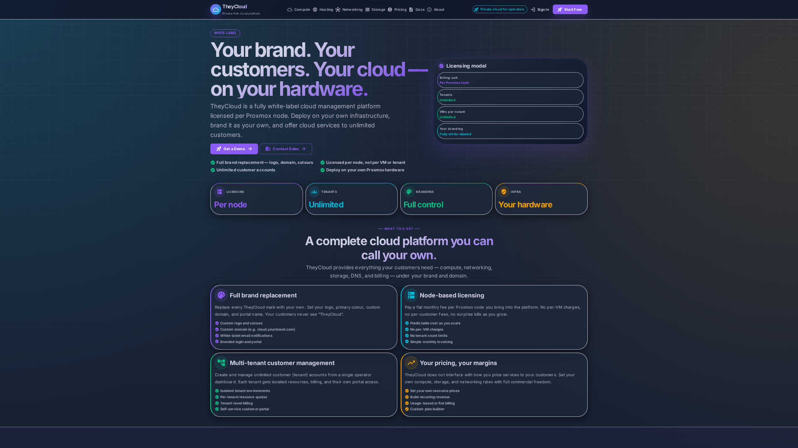

### 🖥️ Client Dashboard UI

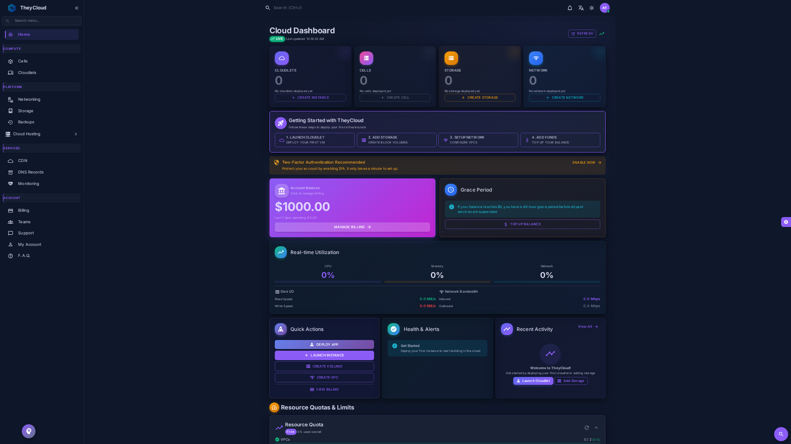
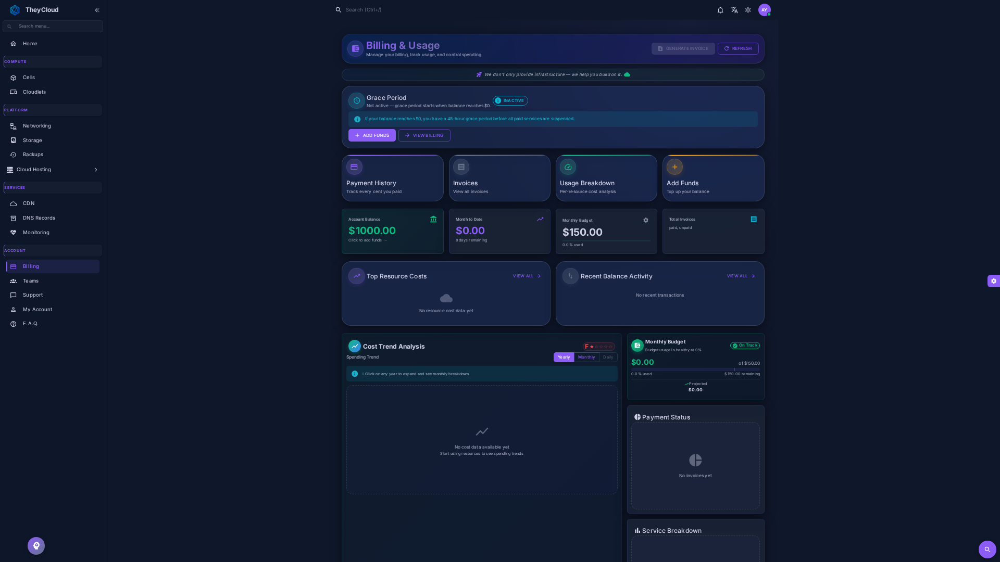

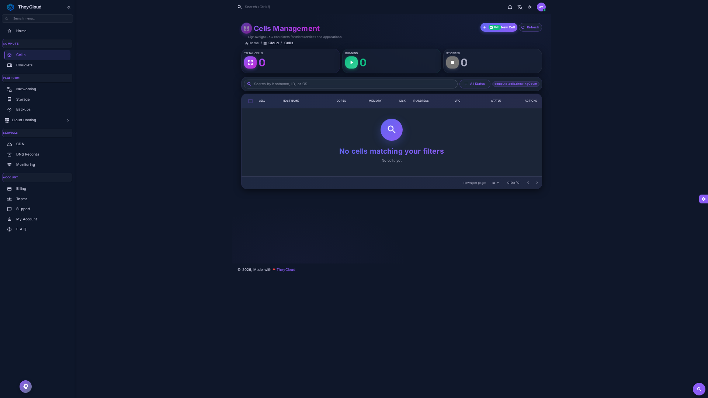
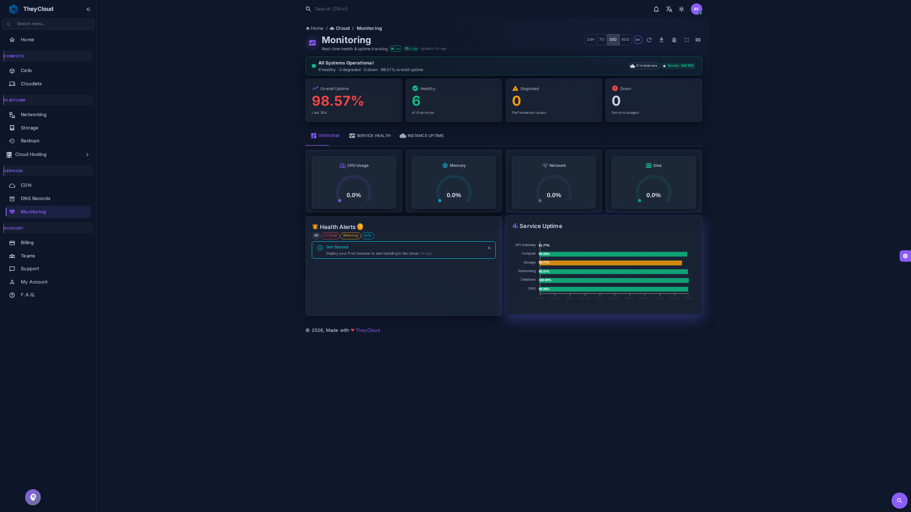

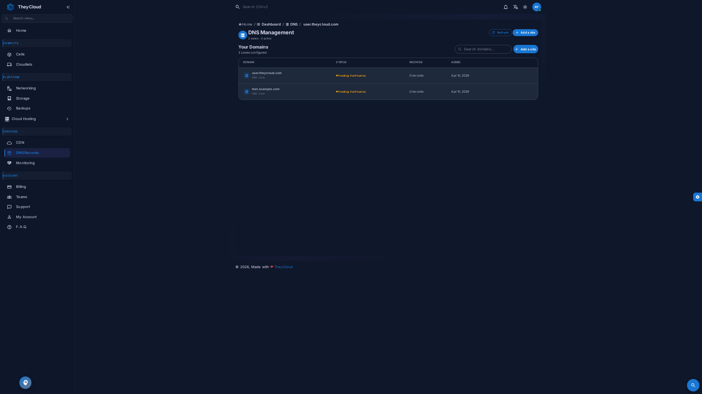
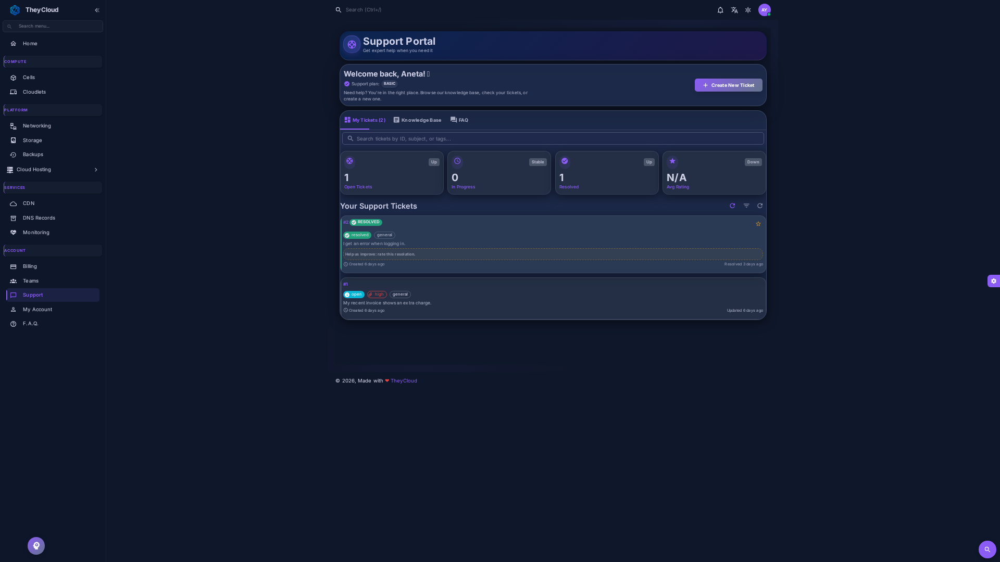

---

## 🛠️ Tech Stack

**Languages**

**Frontend**

**Backend & Data**

**Testing**

**Infrastructure & DevOps**

---

## 💼 Experience

**DevOps Engineer · Pegasystems** — Kraków, Poland · *Oct 2025 – Present*
- Build and optimize CI/CD pipelines and automation tooling for large-scale engineering teams across the globe
- Maintain internal developer infrastructure (Kubernetes, GitOps, cloud services) and implement observability solutions
- Support migrations to modern tooling (GitHub Actions workflows, cloud-native infrastructure)
- *Stack: AWS, Terraform, Kubernetes, GitHub Actions*

**Owner & Solo Architect · TheyCloud** — Remote · *Jan 2023 – Present*
- Designed and built a production-grade white-label cloud infrastructure platform from the ground up
- 250K+ LOC · 124+ REST APIs (OpenAPI 3.0) · 354 domain events · 80%+ test coverage
- Covers: VM/container provisioning, billing, DNS, VPC networking, object storage, support ticketing

**Software Engineer · HCL Software** — Kraków, Poland · *Jul 2020 – Aug 2025*
- Shipped SaaS features across JavaScript, TypeScript, React, Node.js, Java, Ruby on Rails for the BigFix platform
- Led legacy build system migration → **50% faster page loads, 90% reduction in build time**
- Drove React codebase refactoring roadmap; defined design standards for cross-geo teams
- Managed performance testing with JMeter; maintained test suites with Jest, Selenium, Cucumber

**Information Technology Analyst · HCL Technologies** — Kraków, Poland · *Feb 2020 – Jul 2020*
- L1/L2 IT support for AVON Turkey and SASOL Germany — ServiceNow, Active Directory, O365, VPN

**Freelance Mobile App Developer** — *Feb 2019 – Jul 2020*
- Built cross-platform mobile apps using React Native, Expo, Firebase, Node.js, MongoDB

**Co-Founder & Web Developer · Technox** — Istanbul, Turkey · *Dec 2016 – Jan 2021*
- Co-founded and led development of technox.com.tr — a hosting and datacenter services platform
- Built the full customer-facing UI, custom WHMCS plugins, and service automation workflows
- Managed ongoing operations and scalability of the hosting business over 4+ years

**Datacenter Technician & Sysop · Nettiar.net** — Istanbul, Turkey · *Jan 2017 – Dec 2017*
- Rack, blade & tower server installation, network monitoring, and data center system operations

**IT Intern · Metro Istanbul** — Istanbul, Turkey · *Jul 2016 – Sep 2016*
- Developed C# applications for ERP department; optimized database queries using T-SQL

---

## 📊 GitHub Stats

---

## 🎓 Education

| Degree | Institution | Period |
|---|---|---|
| Computer Science | Polish-Japanese Academy of IT, Warsaw | 2018 – 2020 |
| Preparatory Studies | Warsaw University of Technology | 2017 – 2018 |
| Database Systems | Bahçeşehir IMKB Technical High School, Istanbul | 2013 – 2017 |

---

## 📫 Get In Touch

---

*"Strive not to be a success, but rather to be of value."* — Albert Einstein

